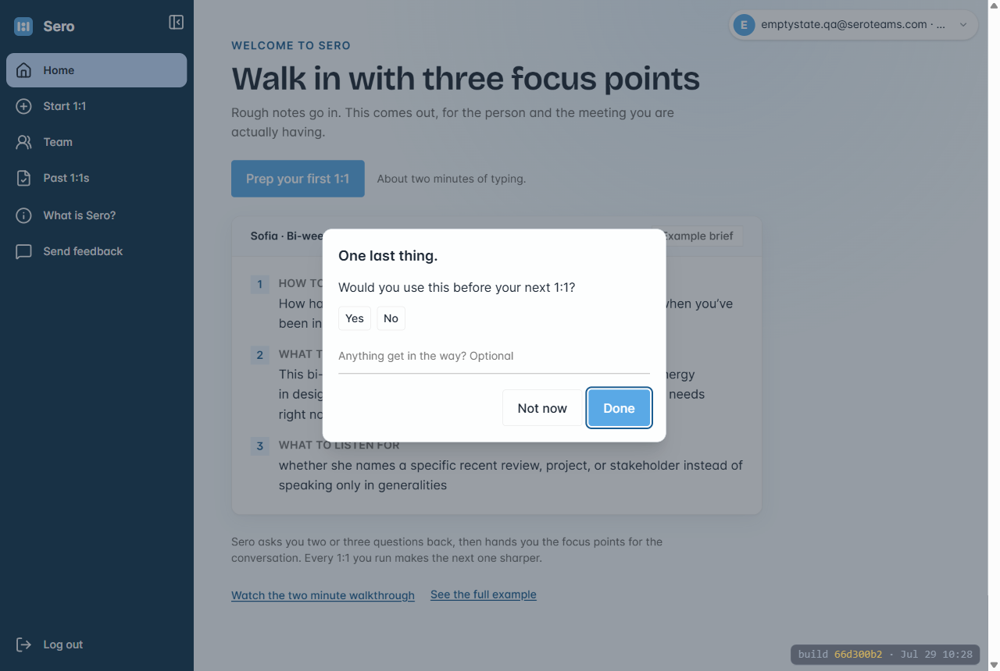
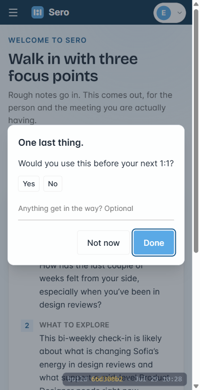

# Phase 1 — The last screen stops interviewing them

**Part of:** [plan.md](plan.md) · **Status:** ✅ · **Finding:** F7

## ✅ GREEN-LIT 2026-07-29 — Carl signed it off from the proof in chat, unwalked (commit `2118b32e`)

He picked option A off the mockup, then green-lit on the screenshots plus the real inbox row rather
than walking to the Finish button himself. Consistent with his evidence-first rule. The one thing
neither of us exercised stays written down: the gate that decides who is shown the card. It was not
changed by this phase.

## Built (2026-07-29)

Carl picked **option A** off the mockup: one question, and the auto star rating goes.

| File | What changed |
|---|---|
| [finish-feedback-modal.js](../../../../admin/src/ui/finish-feedback-modal.js) | Three labelled sections down to one question plus an optional line. `rateMyRun`, `STARS_FOR`, `usefulFromStars`, `initialStars` and the `composeMessage` packer all gone; the note now posts as itself. |
| [finish-feedback-modal.css](../../../../admin/src/styles/finish-feedback-modal.css) | `.ffm__sec` rhythm replaced by one `.ffm__body` flex column; new `.ffm__q` sets the question at reading size (16px) instead of as a small-caps field label. Dead `.js-ffm-u` selector dropped. |
| [briefing.js](../../../../admin/src/stages/briefing.js) | Dropped the `getMyRun` prefetch that existed only to seed `initialStars`, and its now-unused import. **The gate is untouched** (`store.user && !store.scripted`). |
| [finish-feedback-modal.test.ts](../../../../admin/src/ui/finish-feedback-modal.test.ts) | New source-reading guard, 4 cases: the pass-bar question survives and is still saved; the dropped questions and eyebrow labels cannot come back; no rating is derived from the verdict; every exit still resolves. Comments are stripped before matching, because the module's own header names the dropped questions. |

**Free checks:** `npm test` **203/203** (was 202 before, the new guard is the extra), `npm run typecheck`
clean, `lint:copy` and `lint:tokens` both pass.

**Real screen** (customer app on my own server, ports 3471/3475, real registered manager account):

-  — desktop, 440×275, "One last thing." then one question.
-  — 390px wide, fits, no sideways scroll.
- Measured live in the page: question **16px**, note field **14px** (both at or above the floor),
  `text-transform: none`, no letter-spacing. **Zero** `.ffm__sec`, **zero** `.eyebrow`, **zero** star
  buttons left.

**Destination proved, not inferred.** Clicked Yes, typed a line, clicked Done, then read the Feedback
inbox back over the API. The row is really there:

```
verdict: "yes"
message: "the wellbeing meter read red for a team problem"
runId:   2026_Jul29_10-30-127bfd51...
from:    mfix.admin@seroteams.com · Mfix Proof Ltd
```

The message is now the note alone. It used to be prefixed `Useful: Yes · `.

**What I did NOT do, honestly.** I did not walk a whole 1:1 to reach the Finish button, because every
turn of a live run costs OpenAI money and this phase did not need it. Instead the real card was
mounted on the real screen with the real stylesheet and driven through its real save path. So the one
thing not re-exercised is the *gate* in `briefing.js` that decides who sees the card, which this phase
did not change. Scenario 1 below covers it if you want it covered.

**Local test data left behind:** a throwaway `mfix.admin@seroteams.com` account and the one feedback
row above, both in your **local** database only. Delete the row from the Feedback screen whenever.

**Committed local** (parallel chats share this folder, so built work does not sit loose). Nothing is
pushed, so sero.team still shows the three-question form until your next "go live".

---


## Goal

The prompt a tester meets after finishing a 1:1 reads like Sero asking one thing, not like an
internal QA form.

## The problem

Carl spotted it live over Machar's shoulder: *"see that QA prompt. We don't need that QA prompt.
That's for me."* Today [finish-feedback-modal.js](../../../../admin/src/ui/finish-feedback-modal.js)
stacks three labelled sections with button rows:

1. Did the prep give you something useful? (Yes / Sort of / No)
2. Would you use this before your next 1:1? (Yes / No)
3. Where did you get stuck or confused? (one line)

Three stacked questions with small-caps labels is what makes it read as a form rather than a
conversation. It is shown to every logged-in manager on every run
([briefing.js:556](../../../../admin/src/stages/briefing.js) gates only on `store.user && !store.scripted`).

## Why not just delete it

Question 2 is the **pass bar for the whole validation stage**. It is the only automatic read on
whether a tester would come back, and it keeps working when Carl is not in the room. Machar is about
to run sessions Carl is not attending. So the fix is to soften, not remove. (Carl's call,
2026-07-29.)

## Changes

- [admin/src/ui/finish-feedback-modal.js](../../../../admin/src/ui/finish-feedback-modal.js) — down to
  **one question plus an optional line**. Keep `submitRunVerdict` (the return-intent signal) and the
  optional note, which still packs into the same inbox row. No API change, no database change.
- [admin/src/styles/finish-feedback-modal.css](../../../../admin/src/styles/finish-feedback-modal.css) — drop
  the multi-section rhythm the three blocks needed.
- Copy exactly as signed off on the mockup. House rule: no em dashes.

## The trade-off, stated

Question 1 currently doubles as the star rating: Yes/Sort of/No maps to 5/3/1 through `rateMyRun`.
Dropping it means **a finished run no longer auto-rates itself**. Ratings still exist and are still
collected from Past 1:1s, and the admin Ratings screen keeps working, but the numbers will thin out.
Inventing a star value from "would you use this again" would be fabricating a rating, so the honest
options are: lose the auto-star (recommended), or keep two questions. Both are drawn on the mockup.

## Not in this phase

- Changing who sees the prompt. The gate stays as it is.
- The internal run debrief behind the same button. Already correctly fenced to internal admins
  ([briefing.js:547, 563-566](../../../../admin/src/stages/briefing.js)) and Machar never saw it.
- The guest-only feedback card ([briefing.js:181-193](../../../../admin/src/stages/briefing.js)).

## Done when

- [ ] Finishing a real 1:1 as a manager shows one question and an optional line, matching the mockup.
- [ ] The answer still lands in the Feedback inbox — **verified by reading the inbox row**, not by
      reading the routing code.
- [ ] Every way out still lets Finish proceed: Done, Skip, Escape, clicking the backdrop.
- [ ] `npm test` and `npm run typecheck` green; `npm run lint:copy` green (no em dashes).
- [ ] Screenshot of the real card on the real screen.
- [ ] Carl has tested the scenarios below and said go.

## Test scenarios — for Carl

Only walk these if you want to. The card and the saved row are both proved above, and a full
walk means running a real 1:1, which costs money.

`local > customer app > sign in as a manager > run any 1:1 to the end > Finish`

1. **The card, in its real place** — finish a 1:1 and click Finish. You should see **one** question
   and one optional line. This is the only step the proof above does not cover, because it is the one
   that exercises who gets shown the card. ❌ Not OK if it reads like a form, or does not appear.
2. **It saves** — answer, type a line, click Done, then open `admin console > Feedback`. Your answer
   should be a row with the line attached. ❌ Not OK if the row is missing or the line is dropped.
3. **It never traps you** — click Finish, then press Escape without answering. You should land on the
   next screen as normal. ❌ Not OK if Finish stalls or the card sticks.
