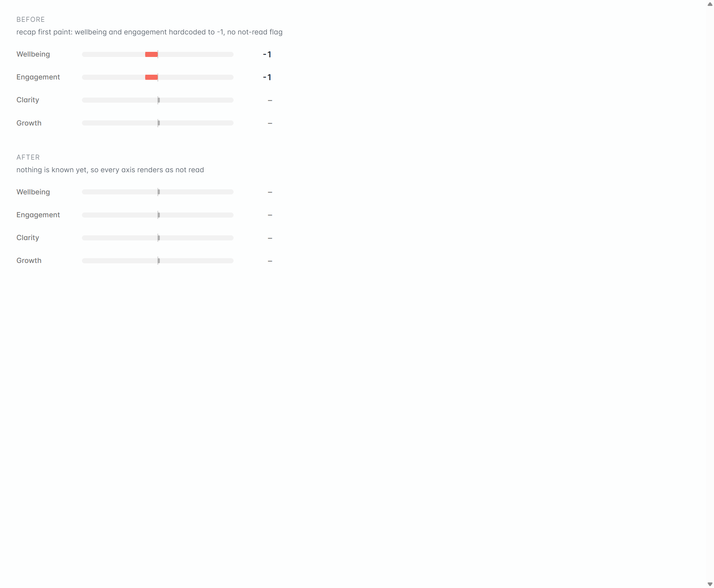

# Phase 3 — A hard team is not a hard week

**Part of:** [plan.md](plan.md) · **Status:** 🔨 built, awaiting Carl · **Finding:** F4

## Built (2026-07-29)

### Correction to what this plan first claimed

The plan said the app's **−1 seed** was probably why Machar saw wellbeing red, and flagged it as
needing confirming on screen. Confirmed, and **the original claim was too strong**. `noRead` already
forces the neutral rail, so an axis Sero never read has always rendered honestly. The seed reached
the screen on exactly one path, and it is a real bug, but it is **not** what Machar was reacting to:

- **What the seed actually did:** the recap's *first paint* hardcoded wellbeing and engagement to
  `-1` with no not-read flag, so both drew a **red −1 bar** for a beat before the real numbers
  arrived. A flash, on every recap.
- **What Machar actually hit:** the settled, engine-scored wellbeing going negative on a team
  problem. That is the prompt half below, and it is the real fix.

Both are fixed. Only the first is provable for free.

### Changes

| File | What changed |
|---|---|
| [content/axes.json](../../../../content/axes.json) | The wellbeing definition now draws the boundary: it reads **the person's own state**, and a team that is not delivering, a slipping date or a broken handover only touch it if they say how it is landing on them. It also stops handing the model `running hot` / `masked fatigue` / `drift toward burnout`, which `final-evaluation.md` separately **bans** from output. The definition was supplying the exact vocabulary another rule forbids. |
| [content/prompts/plan-turn.md](../../../../content/prompts/plan-turn.md) | The person-vs-situation rule was scoped to `purpose: competency` questions, and competency questions are **banned** in the relational arcs where bi-weeklies run, so it could never have fired in Machar's session. Now it applies to every question, and names the cases: deadline pressure, a team not pulling its weight, conflict between other people, a broken handover, a date slipping. |
| [golden-checks.ts](../../../../backend/engine/golden-checks.ts) | New **`runWellbeingSituationGate`**, the live sibling of the existing `runWellbeingMeaningCheck` (which only ever read the finished briefing). Flags a negative wellbeing delta booked on a turn whose answer states no strain. **Detect only** — it flags so the prompt gets fixed, it never edits or suppresses a score. |
| [evals/trust-checks.ts](../../../../evals/trust-checks.ts) | New `WELLBEING_SITUATION_LEAK` hard-fail key, wired beside `RATIONALE_ARC_LEAK`. |
| [rule-registry.ts](../../../../content/prompts/rule-registry.ts) | The prompt rule and the gate are registered as a coupled pair, so editing one without the other goes red in `npm test` instead of drifting silently. |
| [axes.js](../../../../admin/src/ui/axes.js) | One seed, matching the engine's `content/axes.json` (all zeros). The old comment claimed it mirrored the backend; it did not. The seed drives `isBaseline`, so a wrong seed made a genuine −1 read as "not measured" and a genuine 0 read as measured. |
| [briefing.js](../../../../admin/src/stages/briefing.js) | First paint renders every axis as not-read. The third private copy of the seed table is gone; it imports the shared one. |
| [coach-panel-state.ts](../../../../admin/src/ui/coach-panel-state.ts) | The turn's note now lands on the axis that moved **most**, not on every axis that moved. The planner writes one sentence per turn about the strongest signal, so copying it under all of them made a delivery-date sentence read as the reason Wellbeing fell. Others keep their delta and stay blank, which `rowStateFor` already renders honestly. |
| Tests | `golden-checks.wellbeing-situation.test.ts` (6 cases, including strain in a *different* turn not licensing this one, and null-safety); `coach-panel-state.test.ts` updated to the new attribution rule with Machar's exact scenario added as its own case. |

**Free checks:** `npm test` **206/206**, `npm run typecheck` clean, `lint:copy` and `lint:tokens`
pass. The rule-registry test passing is what proves the prompt anchor and the gate are actually linked.

### Proof on the real screen

Both panels are the real component with the real stylesheet, rendered in the running app. Before:
Wellbeing and Engagement read **−1** in red. After: all four read **–**, not measured. Measured in
the page, not eyeballed.

## ⚠️ What is NOT proven

**The engine half.** A prompt change cannot be proven free: `--fixtures-only` replays recorded model
output, so it would replay the old scoring. Untested until a real run:

- that a calm team-problem answer no longer books a negative wellbeing delta, and
- that a real strain answer still does (the failure mode to watch is muting the axis rather than
  aiming it).

The new gate is unit-tested but has **never run against real run data**. Both close in **Phase 4's
single paid run** (~$0.35), which now carries P2's live check as well. One run, three phases' worth
of evidence.

**Committed local.** Nothing pushed.

---

## Goal

When someone calmly describes a problem with their team, Sero stops reading it as **their** wellbeing
falling over.

## The problem

Machar, watching the meters after Daryl described a team conflict:

> "I don't think Daryl's wellbeing is impacted. I think it's the team and he's just not done anything
> about it yet. So the wellbeing score is quite a red flag and maybe it shouldn't be. It's not his
> necessarily personal wellbeing. Maybe the score is quite heavy."

Four separate things make that worse than it needs to be:

**a) The axis definition has no person-versus-situation boundary.**
[content/axes.json](../../../../content/axes.json) tells the model wellbeing means *"running hot, masked
fatigue, drift toward burnout"*. A person describing colleagues not pulling their weight reads as
"running hot" under that wording, with nothing to say otherwise.

**b) The guard that would catch it is scoped to questions that never run here.**
[plan-turn.md:141](../../../../content/prompts/plan-turn.md) says do not score wellbeing negative for time
pressure without stated strain — but only on `purpose: competency` questions, and competency questions
are banned in the relational arcs where bi-weeklies actually run. It could not have fired.

**c) Every real correction happens after the meeting.** `<wellbeing_evidence_rules>`
([final-evaluation.md:191-197](../../../../content/prompts/final-evaluation.md)),
`WELLBEING_TRANSCRIPT_EVIDENCE` ([reviewer.ts:69](../../../../backend/engine/reviewer.ts)) and the confidence
downgrade all run at the briefing stage. The live meter Machar was watching has none of it. Note the
irony: the briefing rules **ban** the exact phrases (`running hot`, `drift toward burnout`) that
`axes.json` hands the model as the definition.

**d) Two display bugs make a small negative look like a red flag.**
- The app seeds wellbeing and engagement at **−1** while the engine seeds all four at **0**
  ([axes.js:20-27](../../../../admin/src/ui/axes.js), duplicated at
  [briefing.js:279](../../../../admin/src/stages/briefing.js)). The comment claims it mirrors the backend. It
  does not. **Confirm on screen first** — the coach panel may mask it by showing an axis as unrated
  until it moves. If it does reach the screen, wellbeing starts negative before a word is said.
- The turn's note is attached to **every** axis that moved
  ([coach-panel-state.ts:50](../../../../admin/src/ui/coach-panel-state.ts)), so a sentence about a delivery
  snag becomes the "why" underneath Wellbeing.

## Changes

- [content/axes.json](../../../../content/axes.json) — wellbeing gains the boundary: this axis reads **the
  person's own state**, not the difficulty of what they are describing.
- [content/prompts/plan-turn.md](../../../../content/prompts/plan-turn.md) — widen the rule at line 141 off
  `purpose: competency` so it covers every question: a described team, process or delivery problem is
  not by itself a wellbeing negative unless the person names how it felt. Route it to `clarity` or the
  note. **This half rides Phase 4's paid run** rather than buying a second one.
- [admin/src/ui/axes.js](../../../../admin/src/ui/axes.js) + [briefing.js](../../../../admin/src/stages/briefing.js) —
  one seed, matching the engine, defined once instead of twice.
- [admin/src/ui/coach-panel-state.ts](../../../../admin/src/ui/coach-panel-state.ts) — the note stops
  claiming to be the reason for every axis that moved.
- **A detect-only gate**, following the `RATIONALE_ARC_LEAK` pattern exactly
  ([golden-checks.ts:195-241](../../../../backend/engine/golden-checks.ts), wired in
  [evals/trust-checks.ts](../../../../evals/trust-checks.ts), registered in
  [rule-registry.ts](../../../../content/prompts/rule-registry.ts)): flag a negative wellbeing delta booked
  against an answer with no stated strain. **It flags, it never rewrites** — house rule. That is how we
  find out whether this keeps happening instead of guessing.

## Not in this phase

- Red/amber/green banding on the meters. There is none today (a −1 and a −10 differ only in bar
  length) and adding it is a design decision, not a bug fix.
- Changing what the briefing says about wellbeing. Those rules are already right.
- Re-tuning any other axis.

## Done when

- [ ] A run where the person describes a team problem with no stated strain does **not** book a
      negative wellbeing delta. Proven from the run's own data, not from the prompt text.
- [ ] Wellbeing and engagement start at zero on screen, matching the engine. Screenshot.
- [ ] The "why" under an axis relates to that axis.
- [ ] The new gate fails when fed a bad case and passes on Machar's own run.
- [ ] `npm test` and `npm run typecheck` green; both linters green.
- [ ] Carl has tested the scenarios below and said go.

## Test scenarios — for Carl

`local > customer app (localhost:3000) > sign in as a manager > New 1:1 > run it > Live scores`

1. **Before anything is said** — start a 1:1 and open **Live scores** before answering anything.
   Every meter should sit at the middle. ❌ Not OK if Wellbeing or Engagement already leans negative.
2. **The team problem** — answer a question with something like **"the team's not pulling its weight
   on the beta and it's holding up the date"**, with nothing about how *they* feel. Wellbeing should
   not drop. Clarity may. ❌ Not OK if Wellbeing goes red off that answer alone.
3. **A real strain answer still lands** — in another run, answer **"honestly I'm shattered, I've been
   working most evenings"**. Wellbeing **should** drop. ❌ Not OK if it does not, because that would
   mean we have muted the axis rather than aimed it.
4. **The reason matches the meter** — look under any axis that moved. The line should be about that
   axis. ❌ Not OK if the same sentence sits under two different meters.
